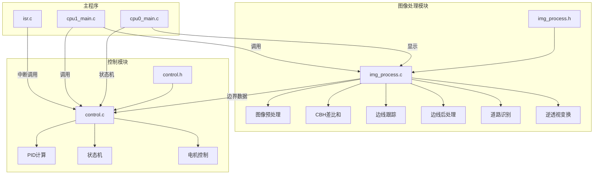

## 用户需求

将现有的 `control_process.c/h` 文件进行拆分重构：

- 将图像处理相关的所有代码和逻辑提取到 `img_process.c/h` 文件中
- 将控制逻辑相关的代码提取到 `control.c/h` 文件中
- 更新主程序文件和其他引用文件的模块依赖
- 确保代码结构清晰且功能模块化

## 产品概述

这是一个基于 TC264 的智能小车项目，使用摄像头进行赛道识别和自动控制。当前代码将图像处理和控制逻辑混合在 `control_process.c` 中，需要拆分为独立模块以提高可维护性。

## 核心功能

- 图像处理模块：图像预处理、边线检测、道路类型识别、逆透视变换
- 控制模块：PID控制、偏差计算、电机速度控制、状态机管理
- 模块间数据共享：边界数据、中线数据、状态变量

## 技术栈

- 平台：Infineon TC264D 双核微控制器
- 开发环境：AURIX Development Studio (ADS) v1.10.2
- 框架：逐飞科技 TC264 开源库
- 语言：C 语言

## 实现方案

### 模块拆分边界

**图像处理模块 (img_process.c/h)**：

- 模块1：图像预处理 — 灰度直方图、OTSU 二值化
- 模块2：CBH 差比和算法 — 自适应阈值 + 差比和扫线
- 模块3：自适应边线跟踪 — 左/右手局部自适应跟踪
- 模块4：边线后处理 — 边界补充、道路宽度、中线计算、丢线检测
- 模块5：道路类型识别 — 角点检测、路口检测、方向选择
- 模块6：逆透视变换 — 坐标变换、鸟瞰图生成
- 模块7：综合处理入口 — img_process()

**控制模块 (control.c/h)**：

- 模块8：PID 控制 — 偏差计算、PID 输出、电机控制
- 状态机：state_control()、now_state
- 控制变量：kp, ki, kd, error_image, output, left_speed, right_speed

### 数据流向

```
摄像头图像 → img_process() → 边界数据 → control_process() → 电机控制
                                    ↓
                               显示模块
```

### 共享数据设计

- 边界数组定义在 `img_process.h` 中，使用 extern 声明
- `control.c` 包含 `img_process.h` 以访问边界数据
- 状态变量 `now_state` 定义在 `control.h` 中

## 实现注意事项

1. 保持现有的双核同步机制不变 (cpu1_img_ready_flag)
2. 中断中调用的 `control_process()` 需要确保无阻塞
3. 共享变量需要使用 `volatile` 和 `__dsync()` 保证数据一致性
4. 保持现有的内存布局 (CPU0/CPU1 DSRAM 分配)

## 架构设计



## 目录结构

```
code/
├── img_process.h        # [MODIFY] 图像处理模块头文件 - 定义图像处理相关常量、数据结构、函数声明、共享边界数据
├── img_process.c        # [MODIFY] 图像处理模块实现 - 包含模块1-7的所有功能代码
├── control.h            # [MODIFY] 控制模块头文件 - 定义PID参数、控制变量、状态机枚举、函数声明
├── control.c            # [MODIFY] 控制模块实现 - 包含PID控制和状态机逻辑
├── control_process.h    # [DELETE] 原合并文件 - 删除或改为桥接文件
├── control_process.c    # [DELETE] 原合并文件 - 删除或改为桥接文件
├── motor.h              # [UNCHANGED] 电机驱动头文件
├── motor.c              # [UNCHANGED] 电机驱动实现
├── tft.h                # [UNCHANGED] 显示模块头文件
├── tft.c                # [MODIFY] 显示模块实现 - 更新 #include 引用
user/
├── cpu0_main.c          # [MODIFY] CPU0主程序 - 更新头文件引用
├── cpu1_main.c          # [MODIFY] CPU1主程序 - 更新头文件引用
├── isr.c                # [MODIFY] 中断服务程序 - 更新头文件引用
libraries/zf_common/
├── zf_common_headfile.h # [MODIFY] 公共头文件 - 更新模块引用
```