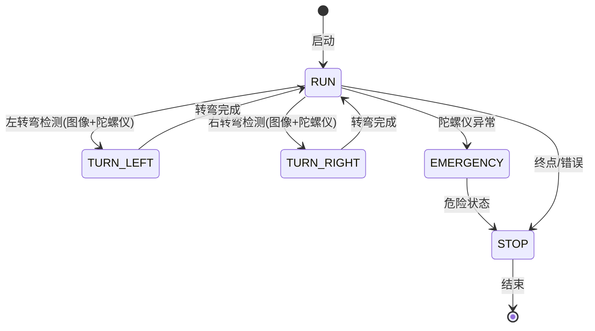

## 用户需求

完善控制链条，采用状态机架构，增加陀螺仪判断功能

## 核心功能

1. **IMU模块封装**：创建 `code/imu.c/h`，封装陀螺仪初始化、数据获取、姿态计算
2. **状态机完善**：扩展 `control.c/h` 中的状态机，增加陀螺仪判断逻辑
3. **多传感器融合**：图像识别结果 + 陀螺仪角速度 → 状态判断
4. **控制链条优化**：状态机驱动 PID 参数调整和电机控制

## 状态机设计

- **RUN**：正常运行，使用标准 PID 参数
- **TURN_LEFT/TURN_RIGHT**：转弯状态，调整 PID 参数和速度
- **EMERGENCY**：紧急状态（陀螺仪检测到异常倾斜或打滑）
- **STOP**：停止状态

## 技术要点

- 陀螺仪角速度阈值判断转弯意图
- 加速度计检测倾斜和异常
- 状态切换平滑过渡

## 技术栈

- 平台：TC264D (AURIX)
- IMU：IMU660RA (6轴传感器)
- 通信：硬件 SPI
- 控制算法：PID + 状态机

## 实现方案

### 1. IMU模块架构

```
imu.h/c
├── imu_init()          // 初始化 IMU660RA
├── imu_update()        // 更新陀螺仪和加速度计数据
├── imu_get_gyro()      // 获取角速度 (°/s)
├── imu_get_acc()       // 获取加速度 (g)
├── imu_get_yaw_rate()  // 获取偏航角速度
├── imu_detect_turn()   // 检测转弯意图
└── imu_check_stable()  // 检测车身稳定性
```

### 2. 状态机架构



### 3. 控制链条流程

```
图像处理 → 道路识别 → 状态判断 ← 陀螺仪数据
                              ↓
                         状态机决策
                              ↓
                         PID参数调整
                              ↓
                         电机控制输出
```

### 4. 关键阈值设计

- 转弯角速度阈值：±30°/s
- 紧急倾斜阈值：±0.3g
- 状态切换延时：100ms（防抖动）

## 目录结构

```
code/
├── imu.h          # [NEW] IMU模块头文件
├── imu.c          # [NEW] IMU模块实现
├── control.h      # [MODIFY] 扩展状态机枚举和函数声明
├── control.c      # [MODIFY] 实现完整状态机逻辑
└── img_process.c  # [MODIFY] 调整状态控制接口

libraries/zf_common/
└── zf_common_headfile.h  # [MODIFY] 添加 imu.h 引用

user/
└── cpu1_main.c    # [MODIFY] 集成状态机控制流程
```